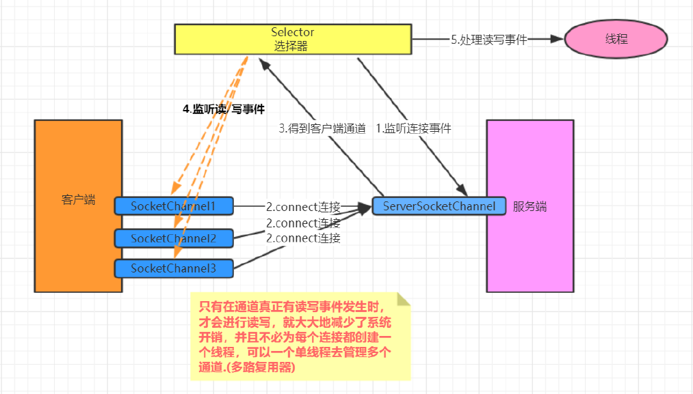

### Seletor

#### Selector基本用法
Selector.open(): 获取一个选择器对象
Selector.select(): 阻塞 监听所有注册的通道，当有对应的事件操作时，会将selectionkey放入集合内部并返回事件数量
Selector.select(1000): 阻塞1000毫秒，监听所有注册的通道，当有对应的事件操作时，会将SelectionKey放入集合并返回
Selector.selectedkeys()：返回存有SelectionKey的集合

#### 4种事件
OP_ACCEPT: 接收连接继续事件，表示服务监听到了客户连接，服务器可以接收这个连接了
OP_CONNECT: 连接就绪事件，表示客户端与服务器的连接已经建立成功 
OP_READ: 读就绪事件，表示通道中已经有了可读的数据，可以执行读操作了
OP_WRITE: 写就绪事件，表示已经可以向通道写数据了
