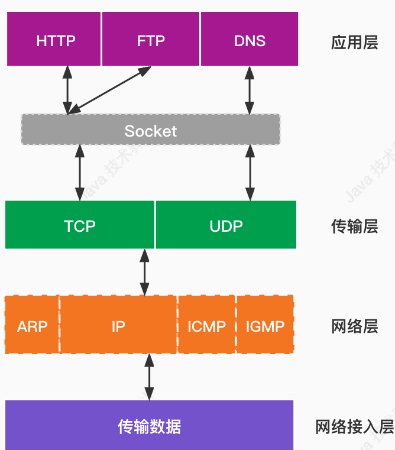

### SocketChannel

&emsp;&emsp;[Socket]{.label .danger}并不是属于[TCP/IP四层模型]{.label .danger}中的任何一层，它的存在只是为了让应用层能够更加简便地将
数据传输给传输层， 应用层不需要关注TCP/IP 协议的复杂内容。我们可以将其理解成一个接口，一个把复杂的TCP/IP协议族隐藏起来的接口，对于应用层而言，
他们只需要简单地调用 [Socket]{.label .danger} 接口就可以实现复杂的TCP/IP 协议，就像设计模式中的门面模式（ 将复杂的TCP\IP 协议族隐藏起来，
对外提供统一的接口，是应用层能够更加容易地使用）。简单地说就是简单来说可以把 Socket理解成是应用层与TCP/IP协议族通信的抽象层、函数库。


### SocketChannel的使用
#### 1.创建SocketChannel
```java
//以下两种方法一样的
SocketChannel socketChannel = SocketChannel.open(new InetSocketAddress("www.baidu.com", 88));

SocketChannel socketChannel1 = SocketChannel.open();
socketChannel.connect(new InetSocketAddress("www.baidu.com", 88));
```
#### 2.连接校验
```java
//测试SocketChannel是否为open状态
System.out.println(socketChannel.isOpen());
//测试SocketChannel是否已经被连接
System.out.println(socketChannel.isConnected());
//测试SocketChannel是否已经正在进行连接
System.out.println(socketChannel.isConnectionPending());
//校验正在进行套接字连接的SocketChannel是否已经完成连接
System.out.println(socketChannel.finishConnect());
```
#### 3. 读操作
&emsp;&emsp;[SocketChannel]{.label .danger}的实现类[SocketChannelImpl]{.label .danger}的[read()]{.label .info}方法
```java
public int read(ByteBuffer var1) throws IOException{
        ...
        while(true) {
            //主要方法
            var3 = IOUtil.read(this.fd, var1, -1L, nd);
            if (var3 != -3 || !this.isOpen()) {
            var4 = IOStatus.normalize(var3);
            var20 = false;
            break;
            }
        }
        }
```
核心方法在[IOUtil.read(this.fd, var1, -1L, nd)]{.label .danger}。
```java
static int read(FileDescriptor var0, ByteBuffer var1, long var2, NativeDispatcher var4) throws IOException {
        if (var1.isReadOnly()) {
            throw new IllegalArgumentException("Read-only buffer");
        } else if (var1 instanceof DirectBuffer) {
            // 使用直接缓存区读取数据
            return readIntoNativeBuffer(var0, var1, var2, var4);
        } else {
            // 当不是使用直接内存时，则从线程本地缓冲获取一块临时的直接缓冲区存放待读取的数据
            ByteBuffer var5 = Util.getTemporaryDirectBuffer(var1.remaining());

            int var7;
            try {
                // 数据写入申请的直接缓冲区内
                int var6 = readIntoNativeBuffer(var0, var5, var2, var4);
                var5.flip();
                if (var6 > 0) {
                    // 将直接缓冲区的数据写入到堆缓冲区中
                    var1.put(var5);
                }
                var7 = var6;
            } finally {
                // 释放获取的缓冲区
                Util.offerFirstTemporaryDirectBuffer(var5);
            }

            return var7;
        }
    }
```
这里我们看到如果[ByteBuffer]{.label .danger}是 [DirectBuffer]{.label .danger}，则调用[readIntoNativeBuffer()]{.label .danger} 读取数据，如果不是则通过[getTemporaryDirectBuffer()]{.label .danger} 获取一个临时的直接缓冲区，然后调用[readIntoNativeBuffer()]{.label .danger}
获取数据，然后将获取的数据写入[ByteBuffer]{.label .danger}中
#### 4.写操作
&emsp;&emsp;写数据[write()]{.label .info}方法和[read()]{.label .info}方法大致一样。